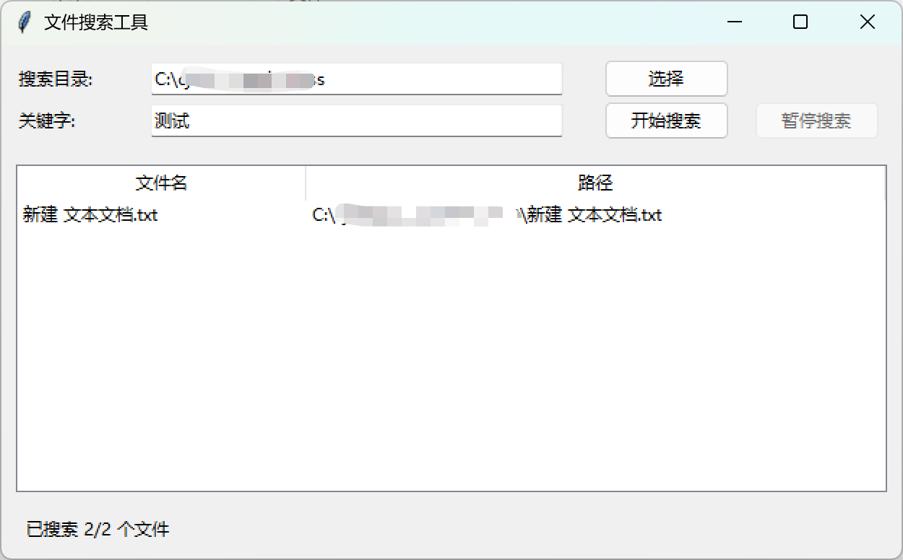

# 文件搜索工具

## 项目功能

1. **文件搜索**
   - 支持按关键字搜索文件和文件内容
   - 可以指定搜索目录
   - 显示搜索进度和结果数量

2. **Java类文件反编译**
   - 自动使用CFR反编译器对.class文件进行反编译
   - 将反编译结果保存在`temp_decompiled`目录
   - 双击.class文件搜索结果时，优先打开反编译后的Java文件

3. **跨平台支持**
   - 支持Windows和Linux系统
   - 自动处理不同系统的路径分隔符问题

4. **用户界面**
   - 使用Tkinter实现的图形界面
   - 包含目录选择、关键字输入、搜索按钮等功能
   - 显示搜索结果列表

## 效果图



## 使用说明

1. 运行`main.py`启动程序
2. 点击"选择目录"按钮指定搜索目录
3. 输入关键字并点击"开始搜索"按钮
4. 双击搜索结果打开对应文件

## 依赖

- Python 3.6+
- CFR反编译器(cfr.jar)
- Tkinter库

## 文件结构

```
.
├── cfr.jar             # CFR反编译器
├── main.py             # 主程序
├── search_logic.py     # 搜索逻辑实现
├── file_search_ui.py   # 用户界面实现
├── temp_decompiled/    # 反编译文件存储目录
└── log/                # 日志目录
```